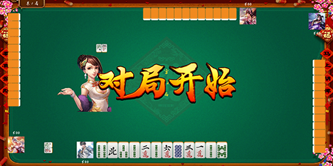
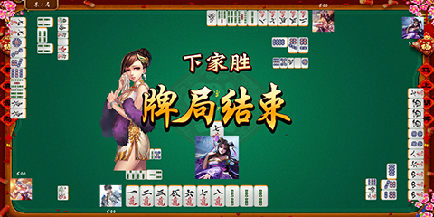
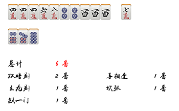

Mahjong 2020
===============
A solo 2D graphics Mahjong Game using [python-pygame][pygame]

Features
---------------------------
- 1 Player / 3 Bots (choice from 7 chinese ancient beauties, full dressed)
- Chinese Standard Mahjong Rules ( 1998.7 Version )
- 81 rules about win points
- Exposed Chow
- Exposed Pong
- Exposed Kong
- Concealed Kong
- Exposed Kong on Exposed Pong
- Mahjong by self
- Mahjong by other player
- Mahjong by robbing a Exposed Kong
- more features will coming soon, if you click the star ;)


How to Install 
---------------------------

1. Install Python 3.7.6 (recommended) from [here](https://www.python.org/download/releases/)

2. Install PyGame 1.9.6
from [here](http://www.pygame.org/download.shtml),
or pip install pygame=1.9.6

3. Install other libs
pip install -r requirements.txt

4. Clone the repository:
```bash
git clone https://github.com/vodka0629/mahjong2020
```
or download as zip and extract.

5. In the directory run
python app.py

How to play
-------------
1. Press <kbd>Enter</kbd> key as default command button
2. Press <kbd>Esc</kbd> key if you don't want to do anything
3. Other Keys:
- <kbd>s</kbd> sort tiles, after you draw a tile and it mess with you
- <kbd>d</kbd> discard the current tile
- <kbd>&larr;</kbd> or <kbd>&rarr;</kbd> change the current tile
- <kbd>c</kbd> exposed chow
- <kbd>p</kbd> exposed pong
- <kbd>k</kbd> exposed kong, concealed kong, exposed kong on expose pong
- <kbd>h</kbd> Mahjong!
4. Put on your headphones! You can heard noisy girl.

How to test
-------------
python test.py


About Mahjong Game
-------------

- [Mahjong Wiki](https://en.wikipedia.org/wiki/Mahjong)
- [Basic Rules about Mahjong](https://corp.mahjongclub.com/basic-rules)
- [Chinese Standard Mahjong](https://baike.baidu.com/item/%E5%9B%BD%E6%A0%87%E9%BA%BB%E5%B0%86/1287558)


ScreenShot
----------





[pygame]: http://www.pygame.org